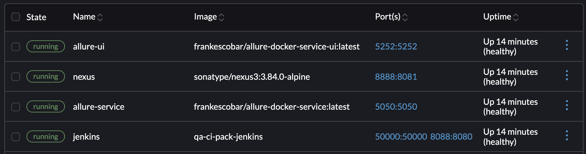

# QACI Pack

QACI Pack includes CI tools for testing.

## What is in QACI Pack

* Jenkins
* Sonatype Nexus
* Allure Report and API

## Service domains

* Jenkins -> https://jenkins.localhost
* Nexus -> https://nexus.localhost
* Allure Report -> https://allure.localhost
* Allure Report API -> https://allure.localhost/api

## Start Services

```bash
docker-compose up -d
```

## To check if services are up

Use docker ps to see if all services are up, healthy.

```bash
docker ps
```



## Initialize Services

Once services are up and running, execute initialization script. This script will install Jenkins plugins, initialize Nexus registries, etc.

```bash
./data/scripts/init.sh
```

## Using *.localhost

All services are reachable by *.localhost domain name. To use this Caddy must be installed and run with this command.

```bash
caddy run
```

## Installing Caddy

For macOS, use Homebrew.

```bash
brew install caddy
```